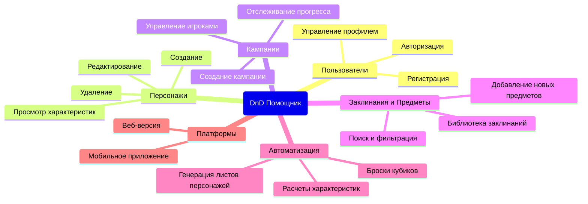
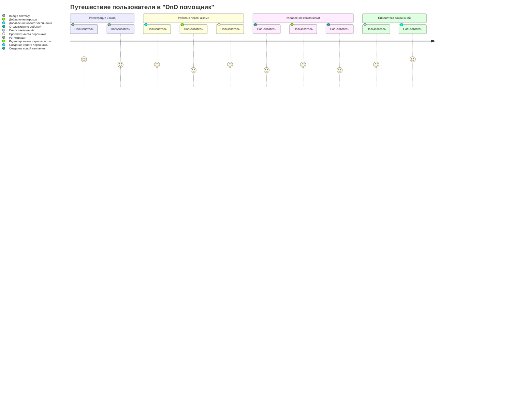
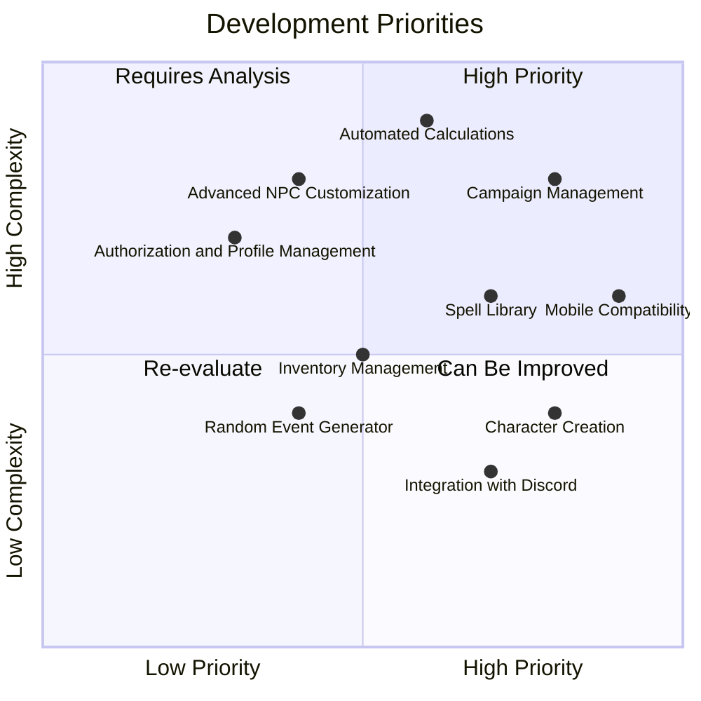
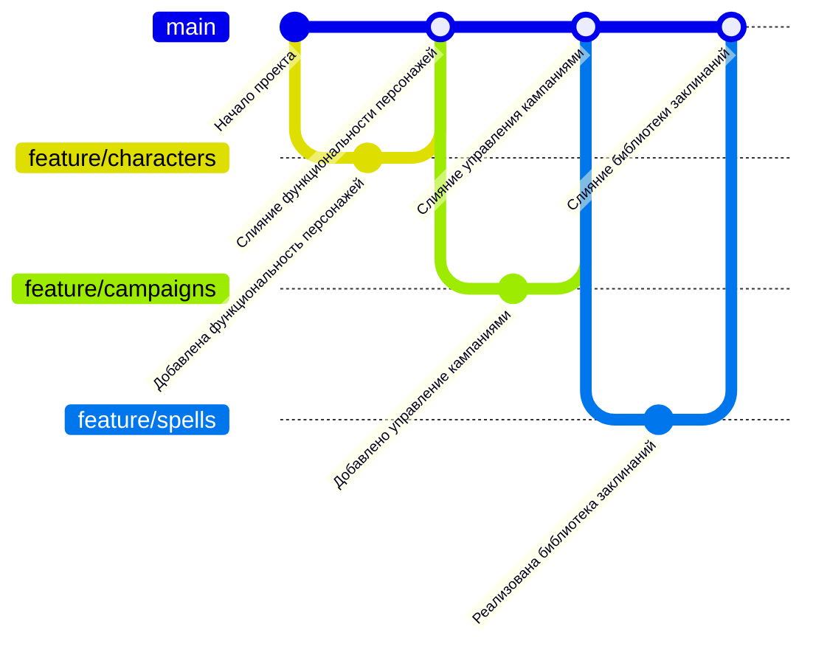

# pkss
**Диаграмма структуры функциональных возможностей (mindmap)**

На диаграмме представлены основные функции системы.
**Диаграмма путешествия пользователя (user jorney)**

Диаграмма описывает состояние пользователя при взаимодействии с системой, с разными её частями и функциями.
**Диаграмма квадрант-граф**

Диаграмма описывает важность разработки тех или иных функций на основе приоритета и сложности реализации.
**Диаграмма git graph**

Описывает дерево коммитов (пример) в удобном формате.
